 

&nbsp;

&nbsp;

---

Full Stack Developer with **3.5+ years at Accenture Solutions**, building scalable enterprise applications from Figma to production. I work across the complete stack — Angular and React frontends, Python FastAPI backends, and AI engineering: LangGraph agents, RAG pipelines with vector databases and reranking models, and real-time SSE streaming for AI-powered UIs.

**Results from four enterprise products at Accenture:**  
`~50%` analyst effort reduced via LLM agent automation &nbsp;·&nbsp; `~40%` faster document processing via RAG &nbsp;·&nbsp; `~30%` performance improvement &nbsp;·&nbsp; `~25%` fewer third-party integration failures

Currently building **[whatif-analyzer](https://github.com/KickSharath/whatif-analyzer)** — an AI assistant that predicts deployment impact before you ship. Open to senior AI / Full Stack engineering roles.

---

## Skills

**AI / LLM**

**Frontend**

**Backend & APIs**

**Databases**

**DevOps & Tools**

**Testing**

---

## Work at Accenture

| Project | Period | Stack | Outcome |
|:--------|:-------|:------|:--------|
| **AI Refinery 2.0** — Generative AI / LLM platform | Dec 2025 – Present | React · FastAPI · LangChain · LangGraph · PostgreSQL · SSE | ~50% analyst effort reduced · ~30% perf gain |
| **RFP Synthesis & DSP** — AI / RAG enterprise system | Jul 2024 – Dec 2025 | Angular · FastAPI · LangChain · Vector DBs · SSE · PostgreSQL | ~40% faster document resolution |
| **GenAI ISP** — Enterprise workflow automation | Nov 2023 – Jun 2024 | Angular · JavaScript · .NET Core · REST APIs | ~25% fewer integration failures |
| **Enterprise Digital Twin** — Industrial IoT | Mar 2023 – Oct 2023 | Angular · D3.js · HTML5 · CSS3 · REST APIs | Real-time multi-plant monitoring |

---

## Open Source Projects

---

## Stats

<picture>
  <source media="(prefers-color-scheme: dark)" srcset="https://github.com/KickSharath/KickSharath/blob/output/github-contribution-grid-snake-dark.svg" />
  <source media="(prefers-color-scheme: light)" srcset="https://github.com/KickSharath/KickSharath/blob/output/github-contribution-grid-snake.svg" />
  
</picture>

---

## Certifications

&nbsp;

&nbsp;

&nbsp;

---

  <a href="https://linkedin.com/in/rangu-sharath-babu">linkedin.com/in/rangu-sharath-babu</a>
  &nbsp;·&nbsp;
  Hyderabad, India

