<picture>
  <source media="(prefers-color-scheme: dark)"  srcset="banner-dark.svg" />
  <source media="(prefers-color-scheme: light)" srcset="banner-light.svg" />
  
</picture>

---

Full Stack Developer with **3.5+ years at Accenture Solutions**, building scalable enterprise applications from Figma to production. I work across the complete stack — Angular and React frontends, Python FastAPI backends, and AI engineering: LangGraph agents, RAG pipelines with vector databases and reranking models, and real-time SSE streaming for AI-powered UIs.

**Results across four enterprise products at Accenture:**  
`~50%` analyst effort reduced &nbsp;·&nbsp; `~40%` faster document processing &nbsp;·&nbsp; `~30%` performance improvement &nbsp;·&nbsp; `~25%` fewer integration failures

Currently building **[whatif-analyzer](https://github.com/KickSharath/whatif-analyzer)** — an AI assistant that predicts deployment impact before you ship. Open to senior AI / Full Stack engineering roles.

---

## Skills

**AI / LLM**

**Frontend**

**Backend & APIs**

**Databases**

**DevOps & Tools**

**Testing**

---

## Work at Accenture

| Project | Period | Stack | Outcome |
|:--------|:-------|:------|:--------|
| **AI Refinery 2.0** — Generative AI / LLM platform | Dec 2025 – Present | React · FastAPI · LangChain · LangGraph · PostgreSQL · SSE | ~50% analyst effort · ~30% perf |
| **RFP Synthesis & DSP** — Enterprise RAG system | Jul 2024 – Dec 2025 | Angular · FastAPI · LangChain · Vector DBs · SSE · PostgreSQL | ~40% faster processing |
| **GenAI ISP** — Enterprise workflow automation | Nov 2023 – Jun 2024 | Angular · JavaScript · .NET Core · REST APIs | ~25% fewer failures |
| **Enterprise Digital Twin** — Industrial IoT | Mar 2023 – Oct 2023 | Angular · D3.js · HTML5 · CSS3 · REST APIs | Real-time multi-plant monitoring |

---

## Open Source Projects

<table width="100%">
<tr>
<td width="50%" valign="top">

**[whatif-analyzer](https://github.com/KickSharath/whatif-analyzer)**

AI assistant that predicts the impact of a code or config change before deployment.

`Python` · `LangChain` · `AI / LLM`

</td>
<td width="50%" valign="top">

**[CashBook](https://github.com/KickSharath/CashBook)**

Full-stack personal finance tracker with real-time balance updates and analytics.

`Angular` · `FastAPI` · `MongoDB`

</td>
</tr>
<tr>
<td width="50%" valign="top">

**[LangChain](https://github.com/KickSharath/LangChain)**

LangChain experiments, reference implementations, and AI workflow patterns.

`Python` · `LangChain` · `LLM`

</td>
<td width="50%" valign="top">

**[KICKBoT](https://github.com/KickSharath/KICKBoT)**

JavaScript bot for automated task handling and workflow automation.

`JavaScript` · `Automation`

</td>
</tr>
</table>

---

## Stats

---

## Certifications

`Microsoft 365 Fundamentals` &nbsp;·&nbsp; `Azure AI Fundamentals — AI-900` &nbsp;·&nbsp; `Azure Fundamentals — AZ-900` &nbsp;·&nbsp; `Security & Compliance — SC-900`

---

  <a href="https://linkedin.com/in/rangu-sharath-babu">linkedin.com/in/rangu-sharath-babu</a>
  &nbsp;·&nbsp;
  Hyderabad, India

